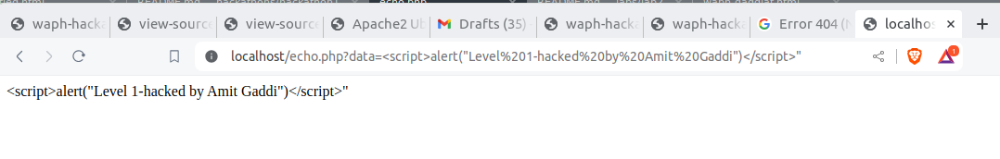

# WAPH-Web Application Programming and Hacking

## Instructor: Dr. Phu Phung

## Student

**Name**: Amit Gaddi

**Email**: gaddiat@mail.uc.edu

**Short-bio**: Amit has keen interest in IT. 


## Repository Information

Repository's URL: [https://github.com/gaddiat-uc/waph.git](https://github.com/gaddiat/waph-gaddiat.git)

This is a private repository for Amit Gaddi to store all code from the course. The organization of this repository is as follows.

# Hackathon 1 - Cross-site Scripting Attacks and Defenses 

## Overview  

This hackathon focuses on hands-on activities to help participants learn cross-site scripting (XSS) attacks and defense mechanisms. In Task 1, participants must launch reflected XSS attacks on seven layers of the given web application, injecting code to display their names using the `alert()` function. They must also predict the vulnerable source code for levels 2 through 6. For each successful assault, participants must give a URL snapshot of the injected XSS payload as well as an inspection of the attack payload in the browser. Task 2 requires participants to analyze and revise their vulnerable code from prior labs using input validation and XSS defensive strategies.This entails rewriting the echo.php code from Lab 1 as well as detecting and protecting external input data channels in Lab 2's current frontend prototype. Each revision must be committed and published to GitHub with suitable messages, and a snapshot of the GitHub commit is required to demonstrate the code revision. The hackathon intends to provide hands-on experience in discovering XSS vulnerabilities and building security measures to secure online applications.

### Task 1: Attacks (35 pts) 

In the task 1 I used `alert()` to display my name when seven layers of reflected XSS attacks are performed on a given web application. Furthermore, for levels 2–6, I examine the [http://waph-hackathon.eastus.cloudapp.azure.com/xss/](http://waph-hackathon.eastus.cloudapp.azure.com/xss/) `echo.php` source code to find attack sites. This exercise gave me hands-on experience finding and exploiting XSS vulnerabilities, while also reinforcing online security fundamentals.

There are seven levels of reflected cross-site scripting attacks on
[http://waph-hackathon.eastus.cloudapp.azure.com/xss/](http://waph-hackathon.eastus.cloudapp.azure.com/xss/)

+  Level 0:

```js
<script>alert("Level 0-hacked by Amit Gaddi")</script>"

```


   

+  Level 1:


<http://waph-hackathon.eastus.cloudapp.azure.com/xss/level1/echo.php?input=%3Cscript%3Ealert(%22Level%201-hacked%20by%20Amit%20Gaddi%22)%3C/script%3E%22>


   

+  Level 2:


Included file `Level2.html`
```html
<!DOCTYPE html>
<html lang="en">
<head>
    <meta charset="UTF-8">
    <meta name="viewport" content="width=device-width, initial-scale=1.0">
    <title>HTML Form</title>
</head>
<body>
    <form action="http://waph-hackathon.eastus.cloudapp.azure.com/xss/level2/echo.php" method="POST">
        Your input: <input name="input" value="&lt;script&gt;alert('Level 2-hacked by Amit Gaddi')&lt;/script&gt;">
        <input type="submit" value="Submit">
    </form>
</body>
</html>

```

Code gues - A cross-site scripting (XSS) vulnerability is most likely caused by inadequate input sanitization in the echo.php web application. By submitting the form, an attacker can use the vulnerability to insert malicious JavaScript code into the webpage. XSS attacks can be launched against this application since the input field is pre-populated with a script tag that calls an alert function. The input from the form is probably taken by echo.php's core source code and echoed back to the browser without being properly sanitized, enabling the injected script to run in the context of the page.


   

+  Level 3:


<http://waph-hackathon.eastus.cloudapp.azure.com/xss/level3/echo.php?input=%3Csc%3Cscript%3Eript%3Ealert(%27level-3%20hacked%20by%20Amit%20Gaddi%27)%3C/sc%3C/script%3Eript%3E>


Code guess - The issue in echo.php is that it does not validate or sanitize input. The script simply echoes user-supplied input without filtering, allowing malicious users to inject arbitrary HTML and JavaScript code, resulting in a Cross-Site Scripting (XSS) vulnerability.

```js
<input><script>alert('level-3 hacked by Amit Gaddi')</script>
```


   

+  Level 4:


<http://waph-hackathon.eastus.cloudapp.azure.com/xss/level4/echo.php?input=%3Cimg%20src=%22..%22%20onerror=%22alert(%27Level%204%20:%20Hacked%20by%20Amit%20Gaddi%27)%22%3E>

Code guess - 
The vulnerability in echo.php is most likely caused by poor input validation and sanitation. By immediately reflecting user-supplied information into HTML output without sufficient filtering, the script allows attackers to inject malicious code, as shown in the provided payload. Specifically, the script fails to properly sanitize the "input" element, allowing attackers to execute arbitrary JavaScript code via the onerror attribute of an HTML image tag.

```js
<input src=".." onerror="alert('Level 4 : Hacked by Amit Gaddi')">
```


   

+  Level 5:


<http://waph-hackathon.eastus.cloudapp.azure.com/xss/level5/echo.php?input=%3Cimg%20src=%22..%22%20onerror=%22%5Cu0061lert(%27Level%205:%20Hacked%20By%20Amit%20Gaddi%27)%22%3E>


Code guess - 
The vulnerability in echo.php is most likely caused by poor handling of user input. The given payload attempts to exploit this vulnerability by inserting JavaScript code into the onerror property of an HTML image tag. The payload uses Unicode escape sequences (\u0061) to obfuscate the alert() function call, allowing it to avoid specific filters or detection methods. This suggests that the vulnerability stems from the script's failure to properly sanitize and validate user input, allowing attackers to execute arbitrary JavaScript code on the website.


```js

```


   


+  Level 6:


<http://waph-hackathon.eastus.cloudapp.azure.com/xss/level6/echo.php/%22%20onmouseenter=%22alert('level%206:%20Hacked%20by%20Amit%20Gaddi%20%20')%22>  


Code guess - 
The vulnerability in echo.php appears to be caused by incorrect handling of user input. The given payload exploits this vulnerability by injecting JavaScript code into the URL route, specifically the onmouseover attribute of an HTML element. This demonstrates that the script does not effectively validate or sanitize input data, allowing attackers to execute arbitrary JavaScript code.


```js
"%20onmouseenter="alert('level%206:%20Hacked%20by%20Amit%20Gaddi%20%20')
```


   


### Task 2. Defenses: (15 pts) 

For Labs 1 and 2, I used XSS protection techniques and input validation to fix security flaws in our code. To stop XSS attacks, I concentrated on validating and sanitizing user input for `echo.php`. I discovered external input data channels, confirmed the input data met specific requirements, and correctly encoded it to thwart XSS attacks in the current front-end prototype from Lab 2. Through these assignments, I improved codebase's security, expanded my knowledge of security best practices in web development, and acquired hands-on experience with security testing and mitigation.


+ echo.php (from Lab 1) (3 pts)


  


  


  


Included file `echo.php`
```php
<?php
  if (!isset($_REQUEST["data"])) {
    die("{\"error\":\"please provide 'data' field\"}");
  }
  echo htmlentities($_REQUEST["data"]);
?>

```
  
+ Current front-end prototype (Lab 2) (12 pts): identify external input data channels, where you must validate the data before using it, and encode the data before displaying/injecting in the front-end interface, i.e., webpage

Included code snippet of file `email.js`
```js
 // Validate the email data
        if (typeof myemail !== "undefined" && myemail !== null && myemail.trim() !== "") {
            myemail = "<a href='mailto:" + myemail + "'>" + myemail + "</a>";
        } else {
            myemail = "Email data is not available";
        }

```


Included code snippets of file `waph-gaddiat.html`


Input Validation & Encoding-
```js
function validateForm(inputData) {
                  var inputData = document.getElementById(inputData).value;
                  if (!inputData) {
                      console.log("Input is null or empty");
                      return false;
                  }
                  return true;
              }

              function encodeInput(input) {
                const encoded = document.createElement('div');
                encoded.innerText = input;
                return encoded.innerHTML;
            }

```

```html

<div>
          <i>Form with an HTTP GET Request</i>
          <form action="/echo.php" method="GET" onsubmit="return validateForm('GETData')">
            Your input:<input type="text" id="GETData" name="data">
            <input type="submit" value="Submit">
          </form>
        </div>

```

```js
async function guessAge(name){
              if (name.length == 0) return;
              const response = await fetch("https://api.agify.io/?name="+encodeInput(name));
              const result = await response.json();
              $("#response").html("Hi " + encodeInput(name) + ", your age should be " + encodeInput(result.age));
            }

```
