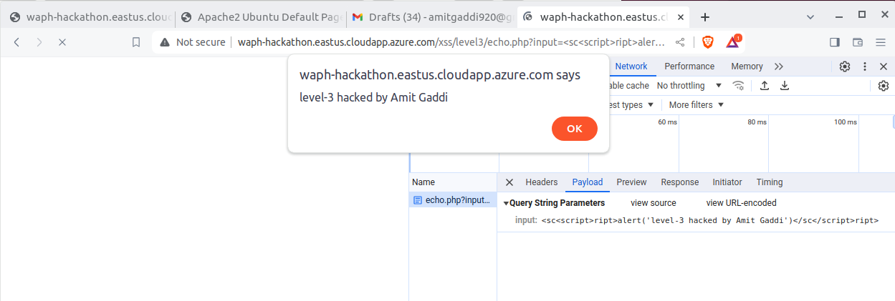

# WAPH-Web Application Programming and Hacking

## Instructor: Dr. Phu Phung

## Student

**Name**: Amit Gaddi

**Email**: gaddiat@mail.uc.edu

**Short-bio**: Amit has keen interest in IT. 


## Repository Information

Repository's URL: [https://github.com/gaddiat-uc/waph.git](https://github.com/gaddiat/waph-gaddiat.git)

This is a private repository for Amit Gaddi to store all code from the course. The organization of this repository is as follows.

# Hackathon 1 - Cross-site Scripting Attacks and Defenses 

## Overview  

This hackathon focuses on hands-on activities to help participants learn cross-site scripting (XSS) attacks and defense mechanisms. In Task 1, participants must launch reflected XSS attacks on seven layers of the given web application, injecting code to display their names using the `alert()` function. They must also predict the vulnerable source code for levels 2 through 6. For each successful assault, participants must give a URL snapshot of the injected XSS payload as well as an inspection of the attack payload in the browser. Task 2 requires participants to analyze and revise their vulnerable code from prior labs using input validation and XSS defensive strategies.This entails rewriting the echo.php code from Lab 1 as well as detecting and protecting external input data channels in Lab 2's current frontend prototype. Each revision must be committed and published to GitHub with suitable messages, and a snapshot of the GitHub commit is required to demonstrate the code revision. The hackathon intends to provide hands-on experience in discovering XSS vulnerabilities and building security measures to secure online applications.

### Task 1: Attacks (35 pts) 

There are seven levels of reflected cross-site scripting attacks on
[http://waph-hackathon.eastus.cloudapp.azure.com/xss/](http://waph-hackathon.eastus.cloudapp.azure.com/xss/)


For each level of attack, you must demonstrate success with a full
URL screenshot with (i) injected XSS to display your name
using `alert()`, and (ii) the payload of the attack inspected in
the browser. The expected screenshot is illustrated in Lecture 8 and the attached slides.

_For each level 2-6, you have to guess the core source code of the `echo.php`
web application, i.e., where the vulnerability is exploited (2 pts each)_

+  Level 0:


   

+  Level 1:


   

+  Level 2:

Included file `Level2.html`
```html
<!DOCTYPE html>
<html lang="en">
<head>
    <meta charset="UTF-8">
    <meta name="viewport" content="width=device-width, initial-scale=1.0">
    <title>HTML Form</title>
</head>
<body>
    <form action="http://waph-hackathon.eastus.cloudapp.azure.com/xss/level2/echo.php" method="POST">
        Your input: <input name="input" value="&lt;script&gt;alert('Level 2-hacked by Amit Gaddi')&lt;/script&gt;">
        <input type="submit" value="Submit">
    </form>
</body>
</html>

```

   

+  Level 3:


   

+  Level 4:


   

+  Level 5:


   


+  Level 6:


   


### Task 2. Defenses: (15 pts) 

Review and  revise your vulnerable,
insecure code in Lab 1 and Lab 2 by implementing input validation and XSS defense methods in: 
  + echo.php (from Lab 1) (3 pts)
  
  + Current front-end prototype (Lab 2) (12 pts): identify external input data channels, where you must validate the data before using it, and encode the data before displaying/injecting in the front-end interface, i.e., webpage

For each revision, commit and push the code to GitHub with an appropriate message, and capture a screenshot on GitHub of that commit to illustrate the code revision (GitHub -> Code -> xx commits ->
click on the commit you revised the code). The expected screenshot is illustrated in Lecture 8 and the attached slides.

```


```