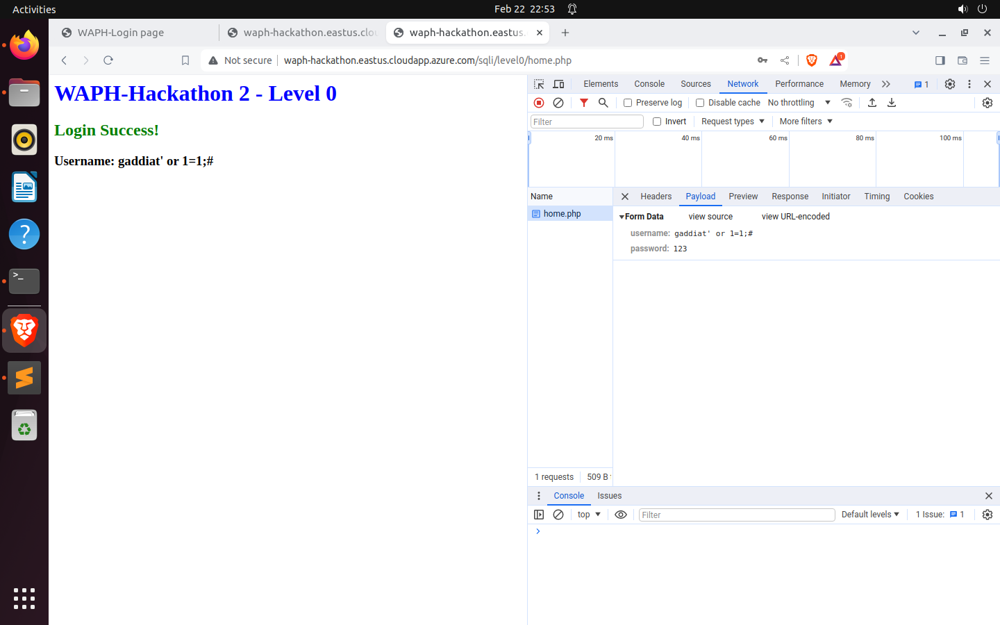
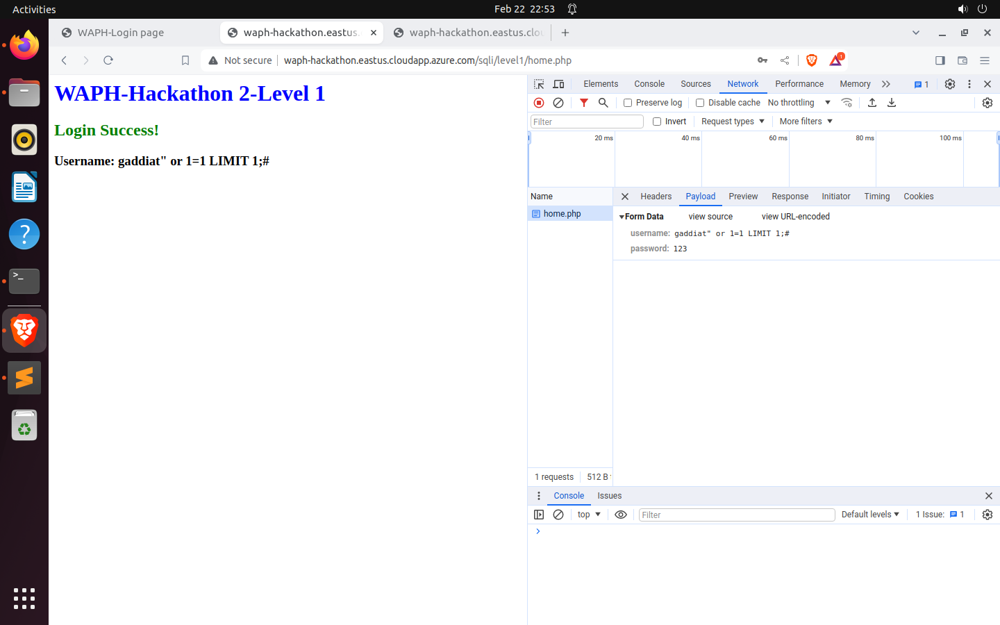
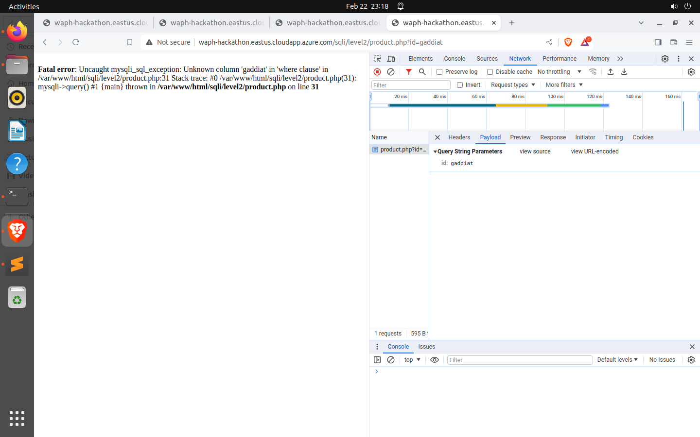
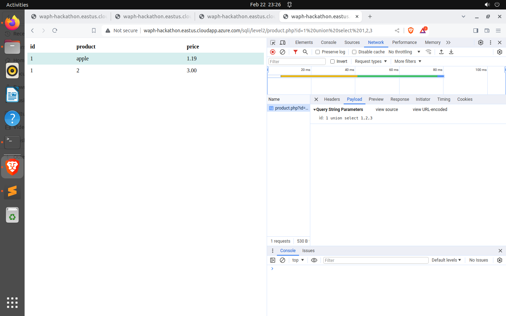
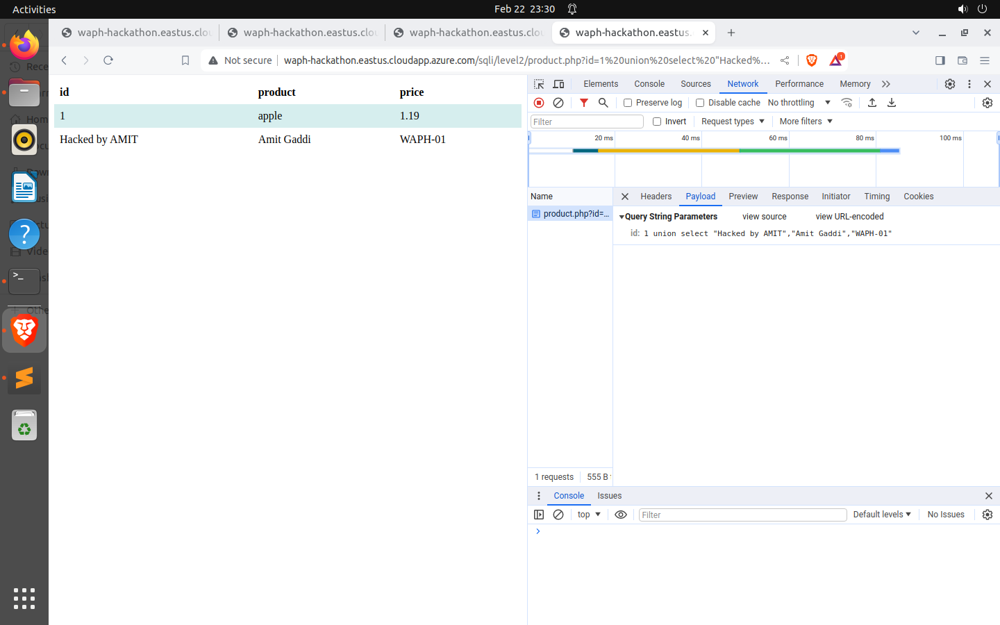
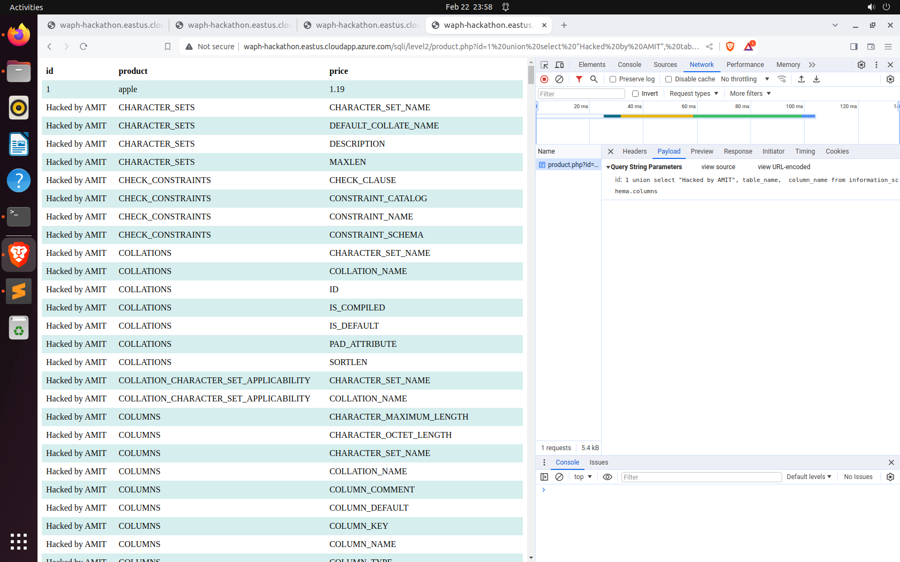
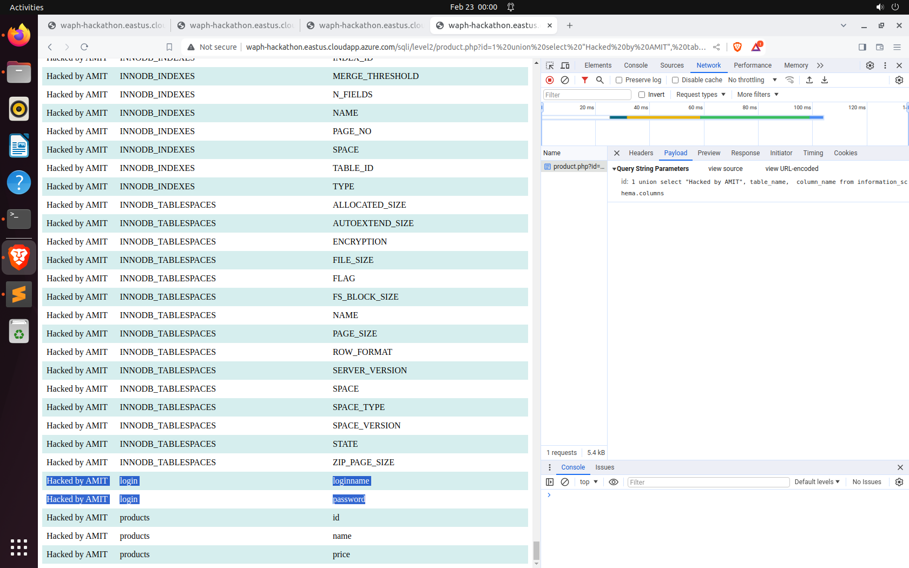
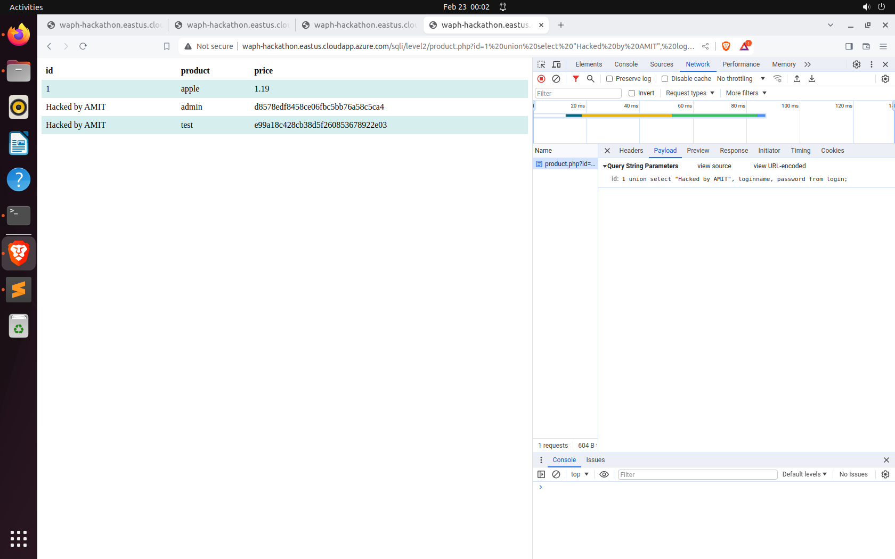
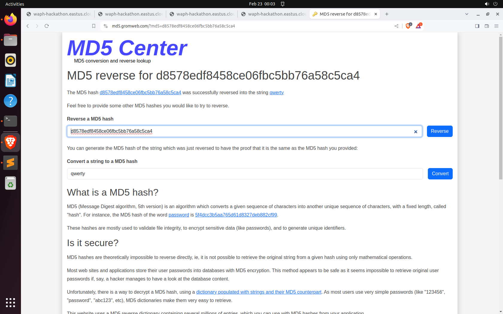
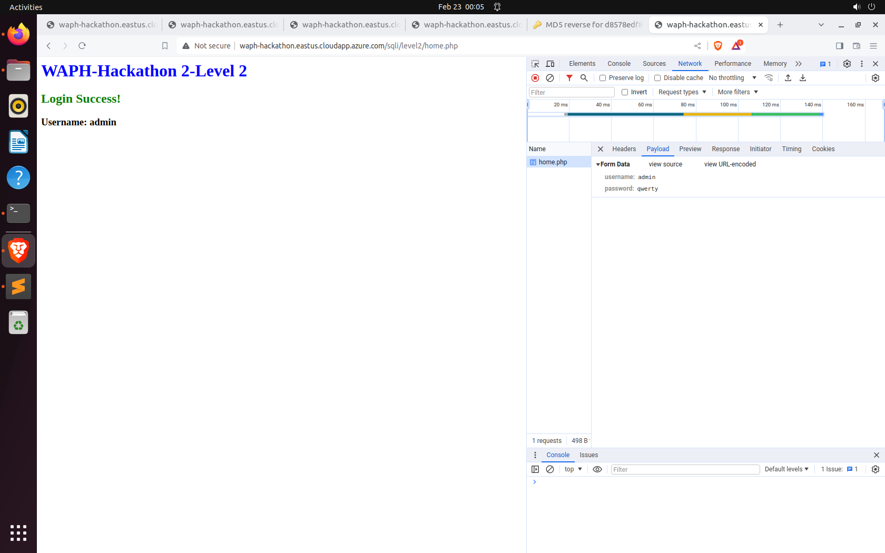

# WAPH-Web Application Programming and Hacking

## Instructor: Dr. Phu Phung

## Student

**Name**: Amit Gaddi

**Email**: gaddiat@mail.uc.edu

**Short-bio**: Amit has keen interests in IT. 


## Repository Information

Repository's URL: [https://github.com/gaddiat-uc/waph.git](https://github.com/gaddiat/waph-gaddiat.git)

This is a private repository for Amit Gaddi to store all code from the course. The organization of this repository is as follows.


# Hackathon 2 - SQL Injection Attacks 

[Hackathon2 Link](https://github.com/gaddiat/waph-gaddiat/tree/main/hackathons/hackathon2)


## Overview and Requirements 

This hackathon has given students interested in cybersecurity and ethical hacking a thorough education on SQL Injection Attacks (SQLi). Through practical experience in a safe online setting, participants will investigate and take advantage of SQLi vulnerabilities in a web application. This hands-on method seeks to enhance comprehension of SQLi causes, execution, and preventive strategies by fusing academic knowledge with practical application examples.

The hackathon, which was first presented in Lecture 13, consists of three increasingly difficult stages, each with a distinct set of goals that mimic real-world weaknesses and attack avenues. Through the use of ethical hacking techniques, participants will be able to recognize, exploit, and reduce SQLi threats, ultimately leading to the ability to obtain unauthorized access by circumventing the target system's login procedures.


### Level 0

By employing SQL injection and my university's username, got around the login verification.



### Level 1


 Used SQL injection to guess the backend SQL query and logged in using your university username.

 The SQL code guess - 
```sql
 SELECT * FROM users WHERE username='gaddiat\';\';#\' AND password = md5(\'\');
 
```
In this sanitized query:

    The single quote (') in the input is escaped as \'.
    The semicolon (;) is likely removed or replaced with its escaped form \;.
    The hash (#) is likely removed or replaced with its escaped form \#.

This sanitized query aims to neutralize any attempt to inject additional SQL commands or comments by escaping or removing potentially harmful characters.




### Level 2

 Finded weaknesses, access data, get login credentials, and enter the system, execute sophisticated SQLi attacks.


#### a. Detecting SQLi Vulnerabilities


 Examine and report any app components that are vulnerable.

 

 The login page may be secure, but the `product.php` page appears to be vulnerable. Here, one can write SQL queries and retrieve critical information from the database. Given the URL structure, it is evident that the details are retrieved based on an 'id', indicating the usage of a WHERE clause.

#### b. Exploiting SQLi to Access Data 

**i. Identify the Number of Columns**:

Determined how many database columns there are.


  
**ii. Display Your Information**:

Showed the login, name, and division of my university.


  
**iii. Display the Database Schema**:

Got the database schema and showed it.


  
**iv. Display Login Credentials (12.5 pts)**

 Showed all passwords and usernames, including hashed ones.

 

 

 

#### c. Login with Stolen Credentials (2.5 pts)


  Accessed the system, used the credentials I have got.

  


