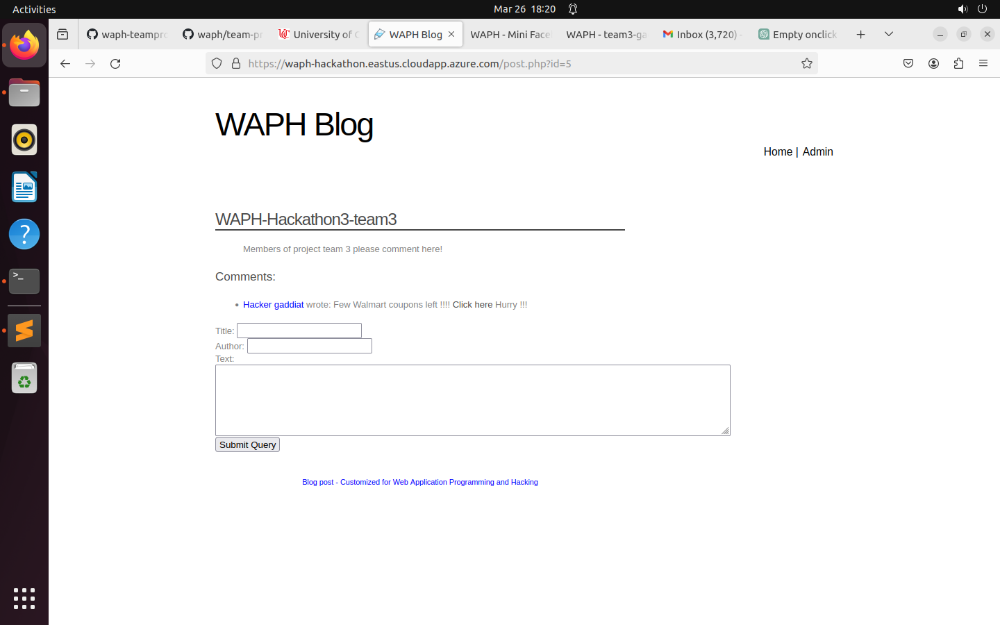

# WAPH-Web Application Programming and Hacking

## Instructor: Dr. Phu Phung

## Student

**Name**: Amit Gaddi

**Email**: gaddiat@mail.uc.edu

**Short-bio**: Amit has keen interests in IT. 

## Repository Information

Repository's URL: [https://github.com/gaddiat-uc/waph.git](https://github.com/gaddiat/waph-gaddiat.git)

This is a private repository for Amit Gaddi to store all code from the course. The organization of this repository is as follows.

# Hackathon 3 -  Session Hijacking Attack

[Hackathon3 Link](https://github.com/gaddiat/waph-gaddiat/tree/main/hackathons/hackathon3)

# Overview

This lab is structured as a hackathon where participants will attack and then resolve vulnerabilities in a small blog web application. Participants are required to complete a series of tasks that demonstrate their ability to inject cross-site scripting (XSS) code to steal session cookies, exploit those cookies to hijack a session for administrator access, and perhaps uncover SQL injection vulnerabilities. The hackathon stresses ethical hacking by demanding that XSS code not be executed automatically to damage other users and prohibiting the posting of new posts that may disrupt the learning experience. Following the assault simulation, participants are required to record a demonstration of their success in stealing the session cookie and hijacking the session.The second portion of the lab focuses on identifying exploited vulnerabilities and providing developer-centric protective methods to avoid similar assaults, combining hands-on hacking experience with cybersecurity education and preventative strategy creation.

# Part I: The Attack

   - **Step 1 [Attacker]:** I opened an browser in my VMware as an attacker and went to the page and added a comment in my team posts where the comment had an link which captured the cookie of the person whoever accessed that link.  

     
   

   - **Step 2 [Victim]:** Then outside of my VMWare in my computer I accessed the blog where I enterd my credentails to login into the blog.

   

   - **Step 3 [Victim]:** Then I navigated into the post where the attacker has last the malacious liked and clicked on it and after clicking it took me to a another page.

   - **Step 4 [Attacker]:** and **Step 5 [Attacker]:** For the steps 4 & 5, once the victim clicked on the link, then I as an attacker opened my terminal to access the logs and where I can see the logs details which has various inforamtion also I can see the victim details that clicked on the link and there in than I can see the victim's cookie. With that cookie I went into the blog and used the developer options of inspect and then changes my cookie with the victim's cookie and then click on admin and then I can observe that I got access to the victims page.

   **Demonstration Video:** 
   [Link to Step-4&5 video](https://github.com/gaddiat/waph-gaddiat/tree/main/hackathons/hackathon3/videos/H3.webm)

- **Bonus:**The application is NOT vulnerable to SQL injection attacks as I tried to login page but I was not able to `https://waph-hackathon.eastus.cloudapp.azure.com/admin/login.php` with userid `gaddiat" or 1=1 LIMIT 1;#` and got Invalid `username/password` . Moreover the `https://waph-hackathon.eastus.cloudapp.azure.com/post.php?id=5` page didn't respond to any appended sql union query changes to the url, it looks like the id is neither injectable or dynamic.

## Part II: Understanding and Prevention
- **a**
   Part I describes an approach that effectively leverages two key online application vulnerabilities: Cross-Site Scripting (XSS) and Session Hijacking.

   **Cross-Site Scripting (XSS):** This vulnerability is exploited in the earliest stages when the attacker injects malicious JavaScript code into the blog application's comments. XSS vulnerabilities arise when an application publishes untrusted data (in this example, comment content) in a web page without sufficient validation or escaping, allowing an attacker to execute scripts within the user's session. By creating a comment with JavaScript code that captures and sends the user's cookies to the attacker's server, the attacker exploits the browser's faith in the web application's content to do illegal operations.

   **Session Hijacking:** When the victim clicks on the malicious link, the XSS code is performed and their session cookie is given to the attacker. Session cookies are important because they frequently hold session identifiers that save the user's state on the web server and allow the server to identify subsequent requests from the same user. Obtaining the victim's session cookie allows the attacker to impersonate the victim on the online application. This is accomplished by the attacker substituting their own session cookie with the victim's cookie, thereby "hijacking" the session. The web application, unable to distinguish between the genuine user and the attacker, gives the attacker the same access as the victim. In this situation, it granted administrator access without the requirement for a login or password.

   Several elements contribute to the attack's success:

    **Lack of Input Sanitization:** The program fails to sanitize user inputs (comments), allowing executable JavaScript code to be injected straight into the web page.  
    **Insecure Session Management:** It is probable that the application did not use secure cookie characteristics (such as HttpOnly and Secure flags), which might have prevented JavaScript from accessing the session cookies.  
    **Insufficient User Authentication Checks:** Once the session ID was obtained, the attacker could gain access to privileged areas of the application without further authentication, indicating that the application does not verify whether the session ID is being used by the original user or has stringent session management policies.  

- **b** 
   To avoid the vulnerabilities exploited in the aforementioned attack, developers should create a comprehensive security plan that covers both Cross-Site Scripting (XSS) and Session Hijacking vulnerabilities. This policy should be implemented at both the individual and team levels to ensure that security is included into the application throughout its development lifetime.    

   **Protection from XSS:**

    **Input Sanitization and Validation:** Ensure that all user input is sanitized and validated, both on the client and server sides. To prevent scripts from being run, potentially harmful characters (such as <, >, ', ", and &) should be removed or encoded in HTML inputs.  

    **Output Encoding:** Use output encoding techniques for presenting user-generated material on a webpage. This guarantees that the browser perceives the content as data rather than executable code. Libraries like OWASP's ESAPI have capabilities for properly encoding output.  

    **Content Security Policy (CSP):** Implement a Content Security Policy header to advise browsers to only execute scripts from trusted sources and disregard any inline scripts or scripts that do not come from the approved domains.  

    **Protection against session hijacking:**  

    **Secure Cookies:** Set session cookies to Secure and HttpOnly. The Secure feature guarantees that cookies are only transferred over HTTPS connections, whereas the HttpOnly attribute limits access to the cookie via JavaScript, reducing the danger of session cookie theft via XSS.  

    **SameSite Cookie property:** Set the SameSite cookie property to prevent the browser from delivering this cookie with cross-site requests. This helps to reduce CSRF (Cross-Site Request Forgery) attacks, which can lead to session hijacking.  

    **Session Management:** Implement strong session management procedures, such as regenerating session IDs every login and enforcing session expiration after a certain amount of inactivity or absolute time.  

    **Development Process and Team Guidelines:**

    **Secure Coding methods:** Teach and teach the development team on secure coding methods. Regularly examine and update these procedures to address new and emerging risks.

    **Security Reviews and Audits:** Integrate security evaluations and audits throughout the development process. Use automatic code scanning and vulnerability detection technologies, as well as manual security evaluations on a regular basis.

    **Incident Response Plan:** Create and manage an incident response strategy. This strategy should contain measures for responding to a security breach, such as how to promptly patch vulnerabilities and notify impacted users.

    **Collaboration and Communication:** Encourage team members to communicate openly and collaboratively about security problems. Security should be a shared responsibility, with all team members helping to ensure that the program is developed securely.

    **Update and Patch:** To guard against known vulnerabilities, ensure that any third-party libraries and dependencies are regularly updated and patched.
