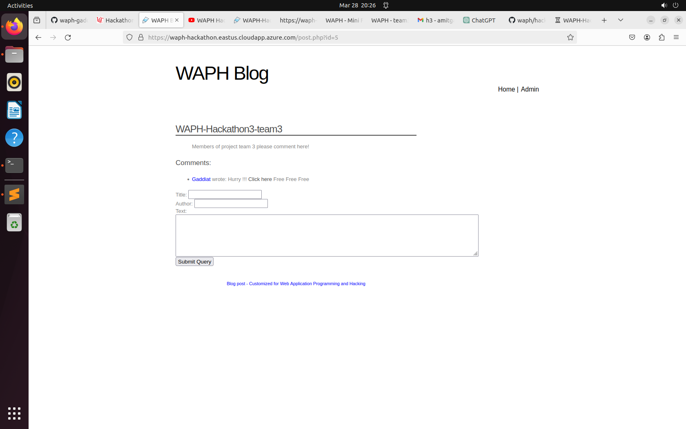

# WAPH-Web Application Programming and Hacking

## Instructor: Dr. Phu Phung

## Student

**Name**: Amit Gaddi

**Email**: gaddiat@mail.uc.edu

**Short-bio**: Amit has keen interests in IT. 

## Repository Information

Repository's URL: [https://github.com/gaddiat-uc/waph.git](https://github.com/gaddiat/waph-gaddiat.git)

This is a private repository for Amit Gaddi to store all code from the course. The organization of this repository is as follows.

# Hackathon 4 -  Cross-site Request Forgery (CSRF) Attack and Protection

[Hackathon4 Link](https://github.com/gaddiat/waph-gaddiat/tree/main/hackathons/hackathon4)

# Overview

This hackathon provides participants with hands-on experience performing and comprehending a Cross-Site Request Forgery (CSRF) attack in a controlled setting. Students play both attacker and victim roles as they target a purposefully weak online application to learn about the mechanics of CSRF attacks. The application in issue is a simple login system that allows password changes after authentication; however, it lacks CSRF safeguards, making it an excellent choice for this study. The hackathon is divided into two parts: the first includes detecting the CSRF vulnerability and creating a malicious request to exploit it, and the second focuses on understanding the underlying weaknesses and providing effective mitigation methods.This hands-on approach stresses not just the crucial aspect of web application security, but also the importance of putting strong measures in place to prevent such vulnerabilities.  

# Part I: The Attack

   - **Step 1 [Attacker]:** Here the vulnurable application is -> [https://waph-hackathon.eastus.cloudapp.azure.com/csrf/login.php](https://waph-hackathon.eastus.cloudapp.azure.com/csrf/login.php),  where we direct the victim to the change password page on the given web application where the attacker automatically changes the password of the user. Here, the attacker embeds the below malicious links into the comment which redirects the victim to the change password page where the new password is set by the attacker.

      **1** [http://192.168.33.128/gaddiat-crsf.html](http://192.168.33.128/gaddiat-crsf.html)
      **2** POST method used 
      **3** newpassword

   - **Step 2 [Victim]:** Here in this step, I have written the code[in the repo](https://github.com/gaddiat/waph-gaddiat/tree/main/hackathons/hackathon3/gaddiat-crsf.html) where the victim's password is changed, and I hosted this page on my localhost.

   Now the link I have embedded into the comment section, as seen in the below screenshot, is where the users can see and click on it.

   

   - **Step 3 [Victim]:** Here in this step, I have acted as a victim and used the CSRF login page to log in and then access the comment section of the blog page. From the comment section, I clicked on the link where I was redirected to the CSRF page where I got an alert; then from there, I was directed to the change password page where the password was already changed. Here, I then logged out from the page, and I tried to log into the same page with the same password, but an alert was shown with "invalid username/password."

   **Demonstration Video:** 
   [Link to Step-3 video](https://github.com/gaddiat/waph-gaddiat/tree/main/hackathons/hackathon3/videos/H4.mov)

## Part II: Understanding and Prevention
- **a**
   Part I of the hackathon focuses on exploiting a cross-site request forgery (CSRF) vulnerability in a susceptible online application. This sort of vulnerability is exploited by deceiving a victim into sending a request to an existing authorized web application, without their knowledge or consent. The major actions performed during the hackathon to exploit the CSRF vulnerability are:

   **Vulnerabilities Exploited**

    **Lack of CSRF Tokens:** The main vulnerability exploited here is the lack of CSRF tokens in the web application. CSRF tokens are unique to each session and user, making it harder for attackers to fake requests. Because the program does not authenticate requests using a token that confirms the user's intent, it is vulnerable to CSRF attacks.

    **Session Riding**: The attack takes advantage of the fact that the application trusts any request made by the user's browser while they are signed in. The attacker can take operations on the user's behalf by hiding a malicious request in a seemingly innocent link and luring them into clicking it.

    **Phishing or Social Engineering:** The attacker employs social engineering to trick the victim into carrying out the CSRF attack by clicking on a link. The attack's effectiveness is largely due to the victim's lack of understanding about the dangers of clicking on unexpected links, particularly when signed into other programs.

   **Why the Attack Was Successful**

    **User Deception:** The attacker successfully tricked the user into clicking on a malicious link. This deception is frequently accomplished using phishing emails or comments, as seen in Step 2, when the attacker inserts the malicious link into a comment box.

    **Browser Trust:** When the victim clicks on the link, their browser immediately transmits the faked request to the application server. Because the victim is already authenticated, the program regards the request as valid, resulting in the unexpected action (password change in this example).

    **No Verification Mechanism:** Because the application does not implement any type of request verification (such as CSRF tokens), there is no way to confirm the user's intent behind the request. This error allows the CSRF attack to go unchecked.

    **Inadequate Security mechanisms:** The susceptible application lacks proper security mechanisms to detect or prevent CSRF attacks. This includes the absence of same-origin policy enforcement, anti-CSRF tokens, and dependence on basic session management that does not validate the request's origin.

- **b** 
   
   The usage of a Secret Validation Token, also known as a Synchronizer Token Pattern, is an effective anti-CSRF method. The mechanism is implemented as follows:

   1. When the server renders a form or other sensitive action page, it produces a random, unique token and correlates it with the user's session.

   2. The token is then added as a hidden field to the form or provided as a separate parameter with the HTTP request.

   3. When the form is submitted or a sensitive action is initiated, the server compares the received token to the one stored in the user's session.

   4. If the tokens match, the request is considered valid and processed. If the tokens do not match, it signals a possible CSRF attack and the request is denied.

   The main ideas behind this process are:

   a. The token is unique to each user session and unexpected, making it difficult for an attacker to guess or fabricate.

   b. The token is associated with the user's session, guaranteeing that only requests from the authentic user's context can contain the right token.

   c. The Same-Origin Policy prevents third-party sites from accessing the token, which is only available to the application that produced it.

   CSRF attacks, including:

   - Requiring re-authentication for sensitive operations (such as password changes and payment transfers).
   - For state-changing operations, use POST requests rather than GET ones.
   - Enabling and enforcing the SameSite cookie attribute to protect against cross-site request forgery attacks on third-party websites.
   - Enforcing stringent Referer header validation for critical queries.
   - Using CSRF tokens with short expiration durations to limit the window of opportunity for assaults.

   By integrating the Secret Validation Token method with other security best practices, web applications may greatly minimize their vulnerability to CSRF attacks while also improving overall system security.
