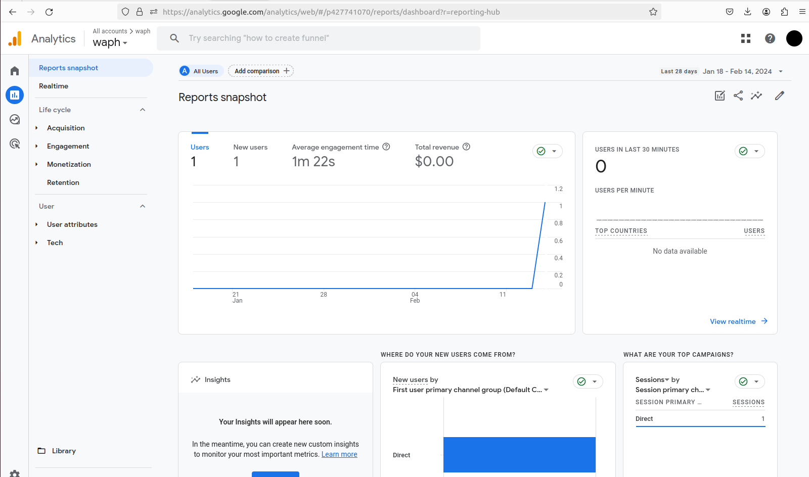

# WAPH-Web Application Programming and Hacking

## Instructor: Dr. Phu Phung

## Student

**Name**: Amit Gaddi

**Email**: gaddiat@mail.uc.edu

**Short-bio**: Amit has keen interests in IT. 

## Repository Information

Repository's URL: [https://github.com/gaddiat/gaddiat.github.io](https://github.com/gaddiat/gaddiat.github.io)

This is a public repository for Amit Gaddi to store all code from the course. The organization of this repository is as follows.

# Individual Project 1

[Individual Project 1](https://gaddiat.github.io/)

## Front-end Web Development with a Professional Profile Website on github.io cloud service

## Overview

The goal of this project is to create and launch a polished GitHub profile page that will attract employers. The website has a thorough resume section as well as a page devoted to explaining the "Web Application Programming and Hacking" course. With an open-source CSS framework like as Bootstrap, the design is improved. The website also includes additional technological components, such integrated public Web APIs for dynamic data retrieval, JavaScript cookies for a customized user experience, and JavaScript features developed with jQuery and other libraries. All things considered, the project demonstrates proficiency with front-end programming as well as a grasp of useful web application ideas.

### General requirements (30 pts): 

 + Professional Profile Website: Created and launched a personal website in the GitHub cloud that highlights my qualifications with a headshot, name, contact details, education, experiences.  

 + Course Introduction Page: Made a link that points to a fresh `WAPH.html` page that describes the course "Web Application Programming and Hacking" as well as pertinent practical exercises.

### Non-technical requirements (20 pts)​

+ CSS Framework: For style, I used an open-source CSS framework like Bootstrap. and linked it with my personal website to form a style over my personal website, since the website will be evaluated as a component of a job application, it should be tailored for prospective employers.

[Resume Templted Used](https://themewagon.com/themes/free-bootstrap-4-html5-personal-portfolio-website-template-resume/)

+ Page Tracker: Used a page tracker(Google Analytics) and embedded code in my `index.hmtl`.

### Technical requirements (50 pts)​

#### Basic JavaScript code (20 pts)​

+ Basic JavaScript Code: Added a digital clock, an analog clock, the ability to show or conceal emails,a topper which shows message when hovered over it and a click to colour chnager. I have used JQuery and Angular framework in my code to implement JavaScriptcode.

+ API Integrations: Connected two open Web APIs: one for joke displays and another one which displays photo of fox everytime you load the page.

+ JavaScript Cookies: Recalled the client's visit by using JavaScript cookies, and show a welcome message in line with it.

