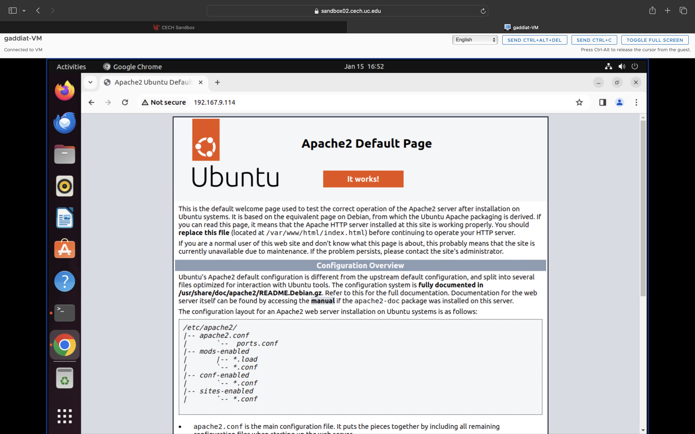
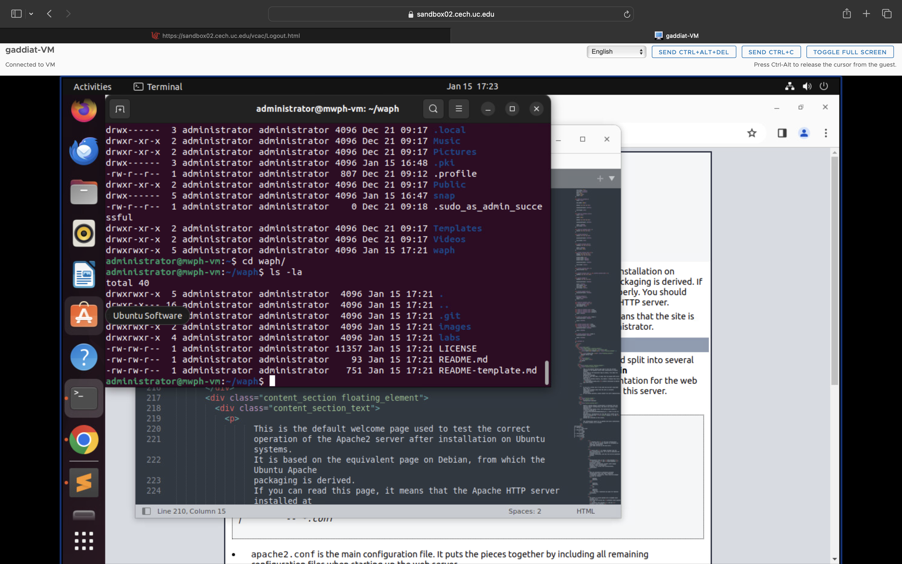
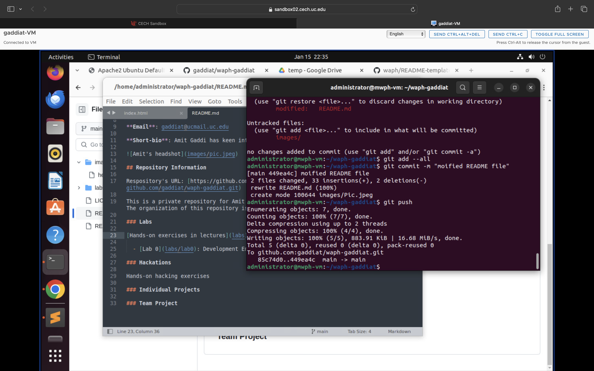
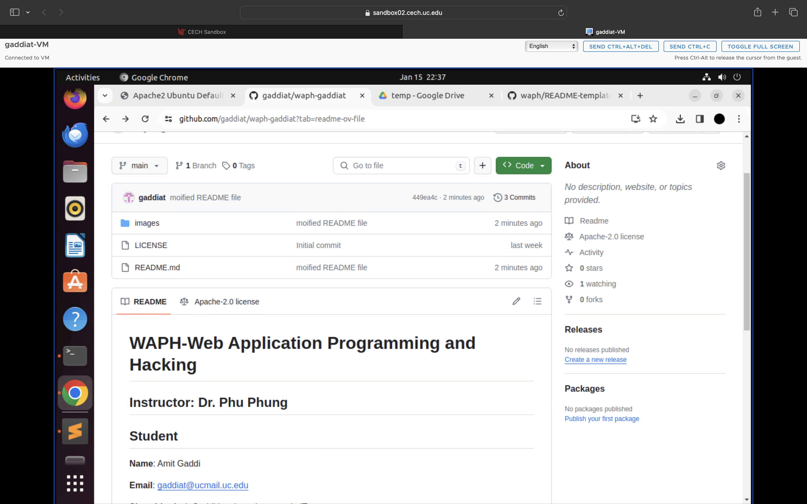

# WAPH-Web Application Programming and Hacking

## Instructor: Dr. Phu Phung

# Lab 0 - Development Environment Setup 

## Overview 

This lab is covered in Lecture 2, with preparation homework in Lecture 1. In Part I, you need to deploy an Ubuntu 22.04 Virtual Machine on the provided online environment and install software and applications. In Part II, you will clone the course repository and your private repository and complete git exercises to write the report. 

## Report 

Created a sub-folder `labs/lab0` with a README.md file to write the report in Markdown format and generated the report to PDF using the `pandoc` application.

## The lab's overview

In this lab we have covered setting up softwares in the Ubuntu Virtual Machine and setting up git repository in the Virtual MAchine and performing git operation on our private repository

[https://github.com/gaddiat/waph-gaddiat/tree/main/labs/lab0](https://github.com/gaddiat/waph-gaddiat/tree/main/labs/lab0)

## Part I - Ubuntu Virtual Machine & Software Installation

Steps-
1,Opened the sand box
2,Deployed my virtual machine
3,Installed the softwares required as in the pdf shared using apt command.

### Apache Web Server Testing

After installing the Apache sever 2, finding out my ip address and using it in the browser to check Apache server 

## Part II - git Repositories and Exercises

### The course repository

Using git commands and ssh cloned the repository.

### Private Repository

Created a private repsoitory from the github website.

[https://github.com/gaddiat/waph-gaddiat.git](https://github.com/gaddiat/waph-gaddiat.git)

First created SSH using the ubuntu terminal and then using the SSH code clone the repository in the machine. performed changes on README markdown file.

## Submission

Use the `pandoc` tool to generate the PDF report for submission from the `README.md` file, and ensure the report and contents are rendered properly.

The PDF file should be named `your-username-waph-lab0.pdf`, e.g., `phungph-waph-lab0.pdf` 

I have used the 'pandoc -f markdown-implicit_figures README.md --pdf-engine=xelatex -t latex  -o lab0.pdf' command to generate by pdf as I was getting an error.