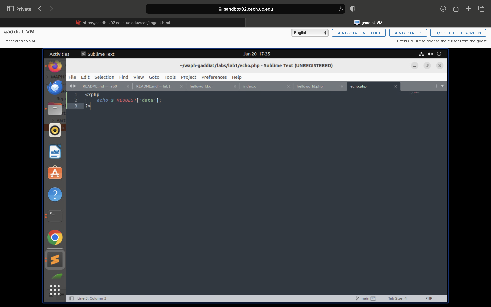

# WAPH-Web Application Programming and Hacking

## Instructor: Dr. Phu Phung

## Student

**Name**: Amit Gaddi

**Email**: gaddiat@mail.uc.edu

**Short-bio**: Amit has keen interests in IT. 


## Repository Information

Repository's URL: [https://github.com/gaddiat-uc/waph.git](https://github.com/gaddiat/waph-gaddiat.git)

This is a private repository for Amit Gaddi to store all code from the course. The organization of this repository is as follows.

# Lab 1 - Foundations of the Web 

[Lab1](https://github.com/gaddiat/waph-gaddiat/tree/main/labs/lab1)

## The lab's overview

In this extensive lab, I went into the deep world of HTTP protocols, using Wireshark to examine HTTP Request and Response messages, as well as HTTP Streams. The hands-on tasks included using telnet to send simple HTTP requests and inspecting the resulting messages in Wireshark. Transitioning to web application programming, I created CGI scripts in C and PHP pages, demonstrating the ability to properly deploy and invoke these apps. Wireshark analysis and curl were used to gain a better understanding of HTTP GET and POST requests. Throughout these activities, the lab not only sharpened my technical skills but also highlighted the importance of security considerations in web applications, giving me a solid foundation for navigating the complexity of HTTP and web development.

## Part I - The Web and HTTP Protocol

### Task 1. Familiar with the Wireshark tool and HTTP protocol

I launched Wireshark with a command and started capturing data using 'any.' After that I opened expanse website in browser, Wireshark captured both the HTTP request and response. By applying a filter, I picked out the HTTP-related data, allowing us to study the specific specifics of the HTTP request, response, and corresponding stream.  

  
  
  

### Task 2. Understanding HTTP using telnet and Wireshark

I initiated Wireshark using the command and commenced capturing data with 'any.' Subsequently, I entered the telnet command in my Ubuntu terminal to interact with the website. Wireshark diligently captured the HTTP request and response. Employing a filter, we isolated the HTTP-related data, allowing us to inspect the specific HTTP request, response, and associated stream.  


  1. A screenshot of your terminal showing the HTTP Request (you typed) and HTTP response from the server.  
  
  2. A screenshot of the HTTP Request message (you typed in telnet above) in Wireshark as in Task 1. Is there any difference between this HTTP Request message and the one the browser sent in Task 1? Hints: What fields are missing in this request compared to the one the browser sent?  
  In the task 1 more fields were sent like user-agent, browser details, language, encoding and connection that are not found in the request sent from terminal.  
  
  3. A screenshot of the HTTP Response message in Wireshark that the server responded to your request. Is there any difference between this HTTP Response message and the one in Task 1?  
  The response data is mostly same but one of the fields are more in the task1 response that is content-encoding.  
  


## Part II - Basic Web Application Programming

###   Task 1. (10 pts) CGI Web applications in C

   a. In the terminal I wrote the code in C program using sublime and saved the program then we compiled the code using ggc and ran the code and copied the cgi file to cgi-bin and opened the file in the browser host as local host file.  
  
  
  

   b. I wrote a basic C program that include a html content which has Header and Paragraph tags and as done in the above task compiled, ran, copied the file in cgi-bin and then opened in the browser.  
   
   Included file `index.c`:  
   ```C
   #include <stdio.h>
   int main(void){
   printf("Content-Type: text/html\n\n");
   printf("<!DOCTYPE html>\n");
   printf("<html>\n");
   printf("<head>\n");
   printf("<title>WAPH Index Page</title>\n");
   printf("</head>\n");
   printf("<body>\n");
   printf("<h1>WAPH</h1>\n");
   printf("<p>WAPH</p>\n");
   printf("</body>\n");
   printf("</html>\n");
   return 0;
}
   ```


  
  
  


###  Task 2 (10 pts). A simple PHP Web Application with user input.

a. First I created a helloworld php program and copied it to var/ww/html locations and then I opened the location in the browser using the local host.  

  
  
  

b. Similar to the above I created a php program and which had echo to get the request data and then copied the program in the Apache location and then opened the local host and in the url I gave my data.  

Security issue with this is, it is vulnerable to security threats, particularly Cross-Site Scripting (XSS) attacks caused by a lack of input validation and sanitization for user input saved in $_REQUEST.  

Included file `echo.php`:
   ```C
      <?php
	    echo $_REQUESTI"data"];
      ?>
   ```

  
  
  


### Task 3 (10 pts). Understanding HTTP GET and POST requests.

a. Before hitting our echo web application, we have to run the Wireshark and then hit he echo php with our data , the packets are captured in the Wireshark and which http filter you can see the request and response in the Wireshark and check out request and response.  

  
  

b. I used the curl command to send the post request to the echo php with the data and the packets were captured in the Wireshark and the data can also been seen there.  

  
  

c. The HTTP get request has data in the url but the HTTP post request doesn't have the data in the url, the Responses that I got to both the request are the same.