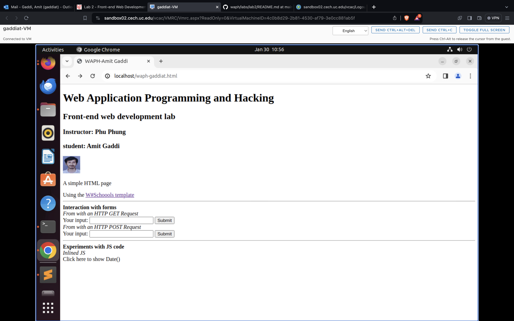
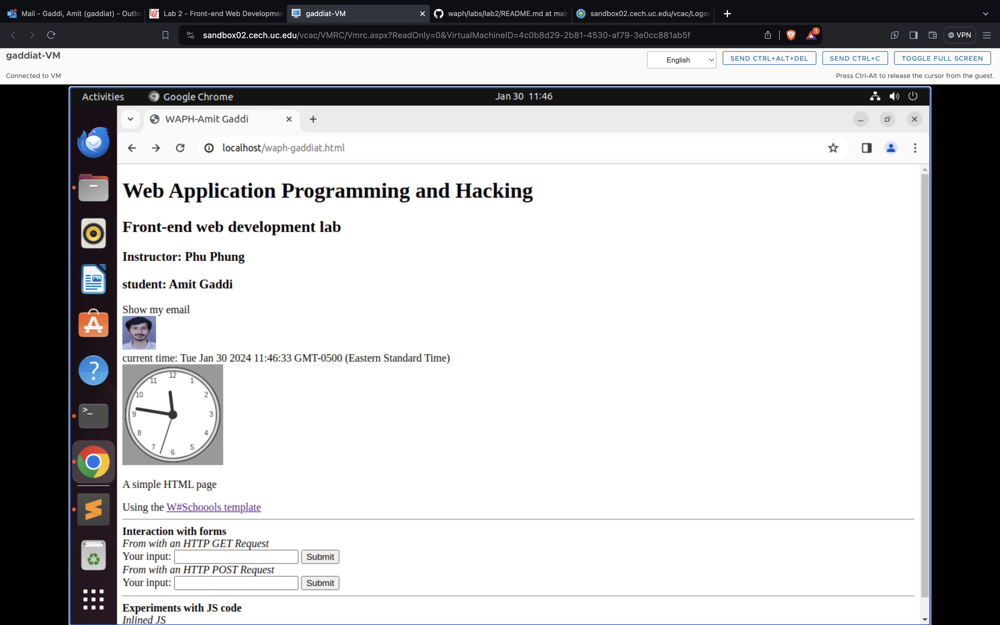
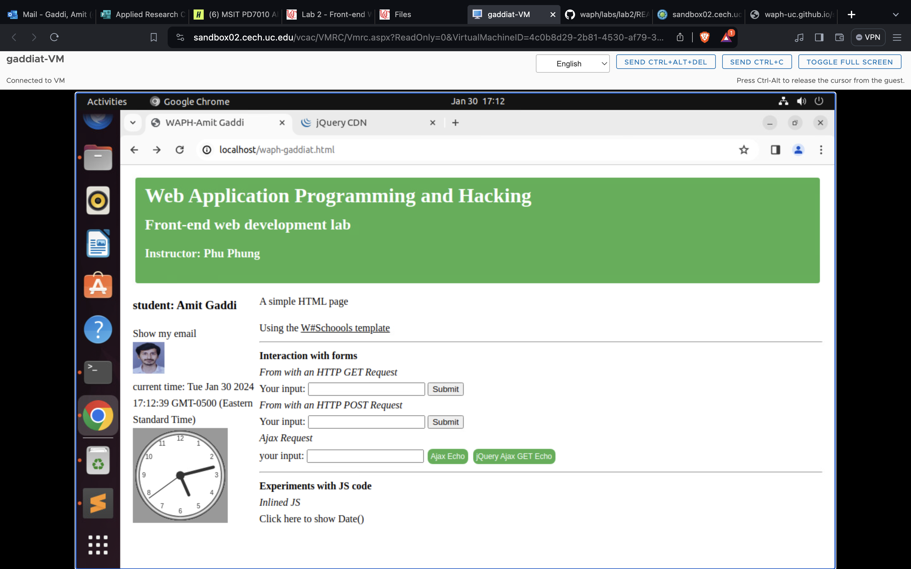

# WAPH-Web Application Programming and Hacking

## Instructor: Dr. Phu Phung

## Student

**Name**: Amit Gaddi

**Email**: gaddiat@mail.uc.edu

**Short-bio**: Amit has keen interests in IT. 

## Repository Information

Repository's URL: [https://github.com/gaddiat-uc/waph.git](https://github.com/gaddiat/waph-gaddiat.git)

This is a private repository for Amit Gaddi to store all code from the course. The organization of this repository is as follows.

# Lab 2 - Front-end Web Development 

[Lab2](https://github.com/gaddiat/waph-gaddiat/tree/main/labs/lab2)

## The lab's overview

This lab focuses on real web development exercises, covering subjects such as HTML, JavaScript, Ajax, CSS, jQuery, and Web API integration. In Task 1, I developed a simple HTML file containing basic elements, an image, and a form, and then use JavaScript to display the current date/time, log key presses, show/hide email, and display digital and analog clocks. Task 2 digs deeper into complex topics such as Ajax for handling asynchronous queries, CSS for decorating the webpage, jQuery for simplifying JavaScript code, and the use of Web APIs to fetch and display dynamic data. By completing these assignments, I acquired hands-on experience developing interactive and dynamic online apps, which helped me better comprehend fundamental web development concepts and approaches.

### Task 1. Basic HTML with forms, and JavaScript

####  a. HTML (5 pts)

In this part of task 1, I developed a simple HTML page which included the Course details at the top using basic tags and the later added a headshot of myself and included 2 form inputs with GET & POST.  

  
  
  
  
  

####  b. Simple JavaScript (15 pts)  

In this part, I used Inline JS to add a current date/time in my HTML page which displayed the time and date when clicked on it, then using the <script> tag I generated a digital clock moreover I created a JS file email.js which was used to show/ hide my email ID when clicked on it and take to me the mail page in addition to that using JS I created an analog digital clock using the function `drawClock()`.  

  
  
  
  
  
  
  
  
  
  
  
  

### Task 2: Ajax, CSS, jQuery, and Web API integration

_Ajax, CSS, and jQuery exercises below are covered in Lecture 5; Web API integration is covered in Lecture 6._

####  a. Ajax (7.5 pts)

In this Task 2 part a, I first created an input with button and div elements to get the input form the user and to see the response I created another div element, and constructed an function `getEcho()` which would take the data from the user and send Ajax GET request to the `echo.php` and returns the response below, I then used the dev tools in the network to see the request which was sent to the `echo.php` page including with data sent by the user

  
  
  
  
  

#### b. CSS (7.5 pts)

In this part, I have added a css code in the the header section under style tag, I have added a code for button which makes the button green and other things and also for the response I changed it which background Orange, moreover we used external css(using the GitHub link) to add a style to our page.  

  
  

####  c. jQuery (5 pts) 

For this section I have added two new button one for GET another for POST, and  then assigned two different functions `JQueryAjax()` & `JQueryAjaxPost()`to each of the respective button. When I clicked on the buttons the request is sent to the echo page, one with the GET and another with POST and the response is retuned below.

  
  
  
  
  
  

#### d. Web API integration (10 pts)

**i.** For this I used Ajax on [https://v2.jokeapi.dev/joke/Programming?type=single](https://v2.jokeapi.dev/joke/Programming?type=single) and wrote JavaScript code using jQuery Ajax to send a request and handle the response to display a random joke from the above API when the page is loaded. Then I inspected in the console to look at the response send by the Joke API and in the network I can see the request and response too.

  
  
  
  

**ii.** Using the `fetch` API  on [https://api.agify.io/?name=input](https://api.agify.io/?name=input)

Here first I created a new button and for that button I wrote a JS code to use the `fetch()` method to call the above API with user input, and display the response results. I then used the inspect to check out the request and response sent to and from that API.  

  
  

