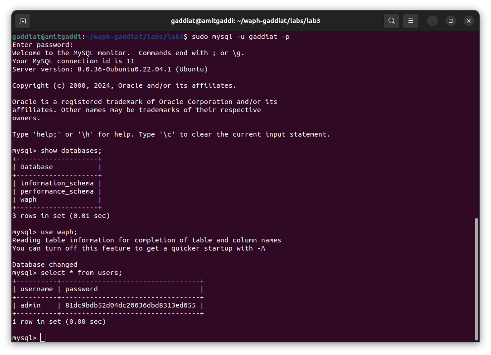
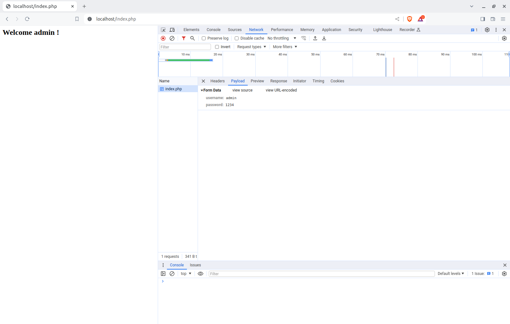
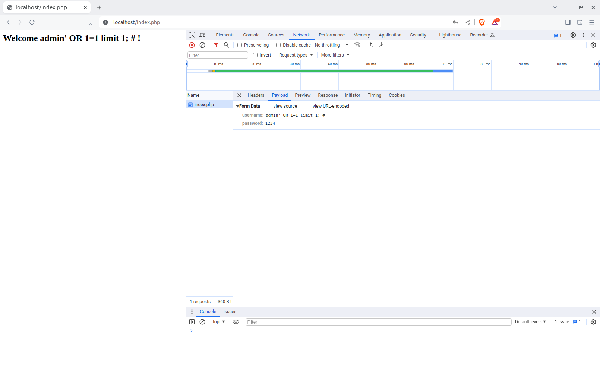
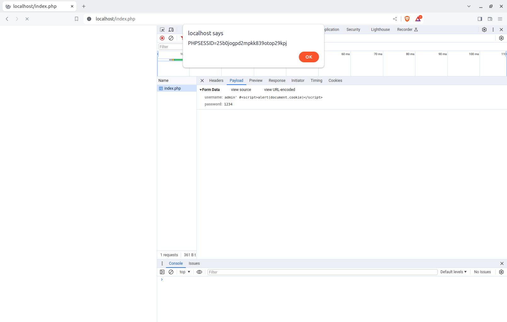
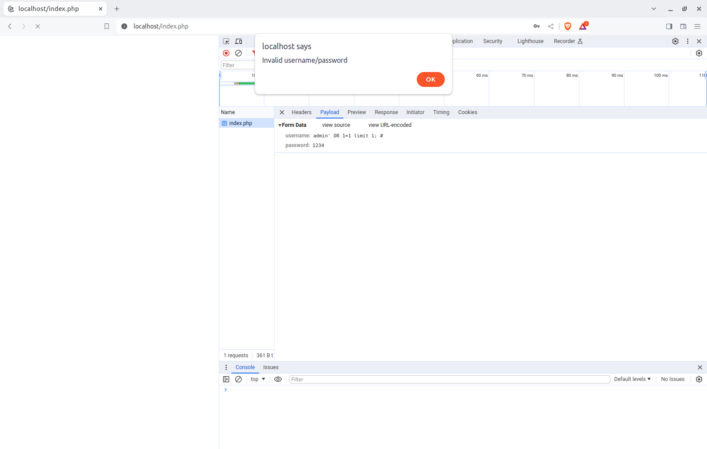

# WAPH-Web Application Programming and Hacking

## Instructor: Dr. Phu Phung

## Student

**Name**: Amit Gaddi

**Email**: gaddiat@mail.uc.edu

**Short-bio**: Amit has keen interests in IT. 


## Repository Information

Repository's URL: [https://github.com/gaddiat-uc/waph.git](https://github.com/gaddiat/waph-gaddiat.git)

This is a private repository for Amit Gaddi to store all code from the course. The organization of this repository is as follows.


## Lab 3 - Secure Web Application Development in PHP/MySQL

[Lab3 Link](https://github.com/gaddiat/waph-gaddiat/tree/main/labs/lab3)

### Overview

I became fully involved in the practical elements of creating, administering, and protecting online applications using PHP and MySQL in Lab 3 of the Secure online Application Development course. The lab is set up to walk me through the process of creating a basic login system that is purposefully weak to expose typical online vulnerabilities like SQL Injection and Cross-Site Scripting (XSS) attacks. Students first learn the fundamentals of database construction and maintenance before moving on to create an unsafe login system, which I then use in practical hacking activities. At the end of the lab, prepared statements for SQL injection prevention and output sanitization to reduce XSS threats are implemented, strengthening the application's security.By taking such a thorough approach, the lab not only made me aware of the challenges that online apps face, but it also gave me the basic security knowledge I needed to address these flaws and create a strong basis for developing safe web applications.  


### a. Database Setup and Management (10 pts)


####  Create a New Database, Database User and Permission

In the file `database-account.sql`, I have written the code to create a new database named `waph` & user with my school's 6+2, moreover I had granted all permissions to the user. To run this command in terminal I used the command 'sudo mysql -u gaddiat -p < database-account.sql'

Included file `database-account.sql`

```sql
create database waph; 
CREATE USER 'gaddiat'@'localhost' IDENTIFIED BY '1234';
GRANT ALL ON waph.* TO 'gaddiat'@'localhost';

```
Then I logged in with the above user into the db.

#### Create a new table `Users` and insert data into the table

I wrote the belo code in `database-data.sql` and ran the file with the non root user in waph databse, this created a new table users and stored the username admin and hased passoword in the table.


Included file `database-data.sql`
```sql
create table users(
	username varchar(50) PRIMARY KEY,
	password varchar(100) NOT NULL);
INSERT INTO users(username,password) VALUES ('admin',md5('1234'));
```
Below is the screenshot of the table and the user data.

  


### b. A Simple (Insecure) Login System with PHP/MySQL

For my page I have used the below login system that checks the password and username that we can created in the above database, we eneter the details in `form.php` page and from the `index.php` it checks the mathces the details and displays the welcome message if the details are valid.

Included snippet of `index.php`

```php
function checklogin_mysql($username, $password) {
		$mysqli = new mysqli('localhost','gaddiat','1234','waph');
		if($mysqli->connect_errno){
			printf("Database connection failed: %s\n", $mysqli->connect_errno);
			exit();
		}
		$sql = "SELECT * FROM users WHERE username='" .$username ."' ";
		$sql = $sql . "AND password =md5('" . $password . "')";
		$result = $mysqli->query($sql);
		if($result->num_rows ==1)
			return TRUE;
		return FALSE;
  	}

```

Below is screenshot of sucessfull login.
  


### c. Performing XSS and SQL Injection Attacks


#### SQL Injection Attacks


Below is the screenshot of the attack where sql query was ran and dsiplayed in the browser by the attacker, due to the failure of validating the code and sanitizaing and verifiying the details of the user input before the sql qurey is ran.

  


#### Cross-site Scripting (XSS)


Below is the screenshot of the attack due to the failure of sanitizing the input which javascript code that displayes the cookie details, here the attacker used the script tag and then passed it as an input to get the details, here the attackers insert malicious code into the system such as the above mentioned. this occurs when the input received is not cleaned.


  


### d. Prepared Statement Implementation


#### Prepared Statement for SQL Injection Prevention


SQL Injection prevention can be done as i did for my page, here the code is not directly taken but rather it implements prepared statements to form the query, below is the code snippet of the function that prevents the sql injection.

Included sinppet `index.php`

```php
function checklogin_mysql($username, $password) {
		$mysqli = new mysqli('localhost','gaddiat','1234','waph');
		if($mysqli->connect_errno){
			printf("Database connection failed: %s\n", $mysqli->connect_errno);
			exit();
		}
		$sql = "SELECT * FROM users WHERE username=? AND password = md5(?)";
		$stmt = $mysqli->prepare($sql);
		$stmt->bind_param("ss", $username, $password);
		$stmt->execute();
		$result = $stmt->get_result();
		if($result->num_rows ==1)
			return TRUE;
		return FALSE;
  	}

```


  

#### Security Analysis (7.5 pts)

- **Prepared Statement Explanation**: Discuss why prepared statements can prevent SQL injection attacks (2.5 pts)

- **Implement Sanitization**: Enhance the code to sanitize outputs, mitigating XSS risks. Provide the revised code in the report with an explanation (2 pts)

- **Discussions (3pts)**: Are there any programming flaws/vulnerabilities in the current code? For example, what if the username/password are empty?; what if there are any database errors?; what if the provided username is not exactly the same as the username from the database.


