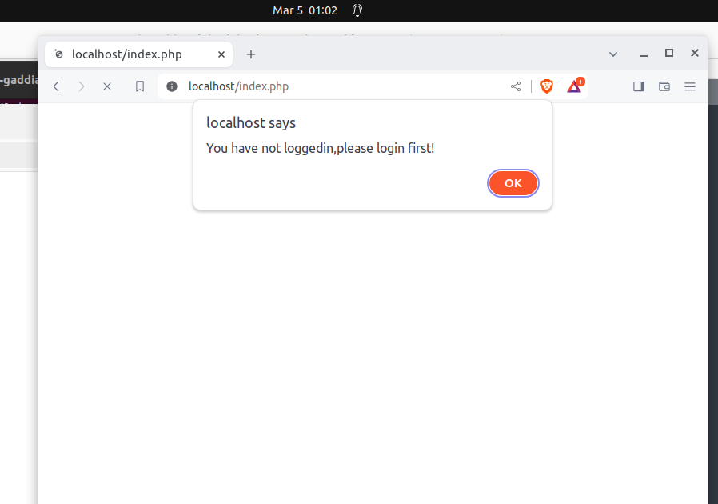

# WAPH-Web Application Programming and Hacking

## Instructor: Dr. Phu Phung

## Student

**Name**: Amit Gaddi

**Email**: gaddiat@mail.uc.edu

**Short-bio**: Amit has keen interests in IT. 

## Repository Information

Repository's URL: [https://github.com/gaddiat-uc/waph.git](https://github.com/gaddiat/waph-gaddiat.git)

This is a private repository for Amit Gaddi to store all code from the course. The organization of this repository is as follows.

## Lab 4 -A Secure Login Systwm With Session Authentication

[Lab4 Link](https://github.com/gaddiat/waph-gaddiat/tree/main/labs/lab4)

## Overview

This lab offers a comprehensive investigation into PHP web application session management and security, along with practical exercises. Through the implementation, monitoring, and preservation of session-based authentication protocols, I acquired pragmatic understandings of crucial security protocols. I learned about the inner workings of session handshaking procedures by first examining the fundamentals of sessions using tools such as Wireshark. The exercises that follow focus on locating and fixing problems related to insecure session authentication. In order to prevent possible session hijacking attempts, these actions culminate in the deployment of strong security measures, such as the adoption of HTTPS and the application of certain session cookie settings, including the HttpOnly and Secure flags.

Hands-on exercise that compares browser information saved in session data in order to identify session hijacking. I got an understanding of the intricacies of session management through these assignments, as well as the value of using safe authentication procedures and putting in place strong security countermeasures to protect web apps from frequent attack vectors.

## Task 1: Understanding Session Management in a PHP Web Application

### 1.a. Deploy and test `sessiontest.php`

Here I created a new php page which caputured the session of the user and displayed then the numbers of times that they have visited the page, I used two different browsers and accessed the same page.

  

### 1.b. Observe the Session-Handshaking using Wireshark

Using wireshark I captured the packets of the session handshaking, I first ran the wireshark and then opened the session page in browser and then reloaded the page, then I stopped the wireshark and saw the captured http packets and saw the request send and the response recived one where the cookie is set and another where the cookie is dispayed with the response showed to the user.

  

### 1.c. Understanding Session Hijacking

We can session hijack using the cookies where you can capture /copy the cookie from one browser and the use the same cookie and set the cookie value same and you can now access the page hijack the session which was displalyed in the another browser. 

  

## Task 2: Insecure Session Authentication

### 2.a. Revised Login System with Session Management

Here I modified the `index.php` page and impletemtn the session managment where we created session and also a new link which leads to the `logout.php` page, in the session managment I created in such a way that an unauthenticated user when trys to access `index.php` page gets an alert

  

### 2.b. Session Hijacking Attacks

Here we used the cookie to hijack the session from one browsert to another, as seen in the screenshots, I captured the cookie from one browser and set the same cookie value in another browser to got access to the page without entering the credentials.

  

 

 

## Task 3: Securing Session and Session Authentication

### 3.a. Data Protection and HTTPS Setup

Here we generated a key and stored in apache and configured the ssl file and then accessed the web page with HTTPS and as the certificate is not valid, I have to add an exception and below screenshot is the certificate that is showed in browser, moreover we can access our page with https too.

 

### 3.b. Securing Session Against Session Hijacking Attacks - setting HttpOnly and Secure flags for cookies  

Here in the `index.php` I added a code to set the parameters of the cookie before starting the sessuin, here the values set were - time, path, domain, httponly and secure. after deployin the code you can now see as seen in the below screenshot the value is set to ture and now the cookie id cannot be accessed.

 

### 3.c. Securing Session Against Session Hijacking Attacks - Defense In-Depth

After modifying the code to add the new protectiion layer, now even if we try to access the page with the another browser we would not be able to access the page even if we have the cookie id as here we are using browser identification.

 